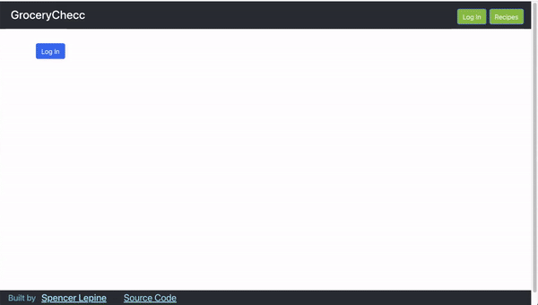
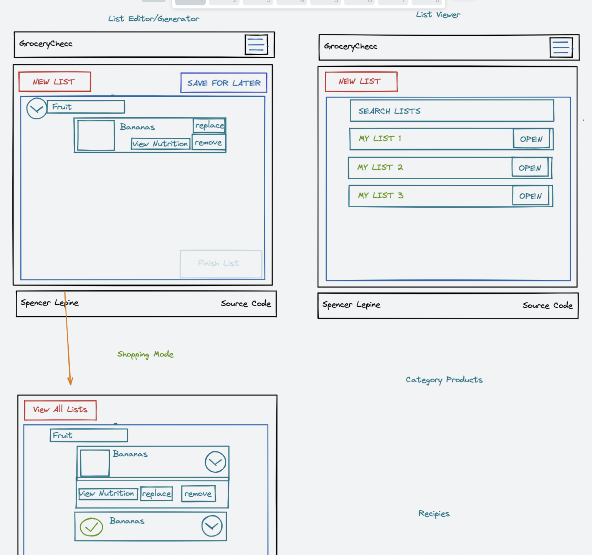

# GroceryChecc [](https://github.com/spencerlepine/hr-sea19-mvp/actions/workflows/main.yml) - [Demo](https://grocery-checc.herokuapp.com/)

GroceryChecc simplifies brainstorming a shopping list by helping find relevant grocery products and replacement items for you. Helping busy parents save time by generating a complete grocery shopping list from the couch.

The straight-forward interface provides a clean user experience to emphasize critical features. This app helps prioritize essential food products to give a solid foundation of a shopping list.

Automating this process saves time and money. With a dynamic list stored for each user, it is easy to review a birds-eye list of all groceries at once.

## Project Overview:

The goal of this project was building a full-stack application in two days. The biggest challenge of this was managing time and balancing trade-offs between functionality and presentability.

- Connected MongoDB storing grocery lists private to each user
- Implemented Firebase Authentication tracking user accounts to store saved lists
- Built the backend API to fetch and serialize data from the Sequelize API and the OpenFoodFacts API
- Used a straight-forward client interface assisted by React-Bootstrap to simplify site navigation



## Setup:

```sh
cd client
npm install
cp .env.sample .env # udpate SERVER_URL (w/ PORT)
npm start
# *Open new terminal window*
cd ../server
npm install
cp .env.sample .env # udpate PORT
npm start
```

## 📦 Technologies:
- [React](https://reactjs.org/)
- [MongoDB](https://www.mongodb.com/)
- [Node.js](https://nodejs.org/en/)
- [Express](https://expressjs.com/)
- [OpenFoodFacts API](https://wiki.openfoodfacts.org/API/)
- [Spoonacular API](https://spoonacular.com/food-api)
- [Sequelize](https://sequelize.org/)
- [React-Bootstrap](https://react-bootstrap.github.io/)
## Screenshots
### Home Page
Create a new list, view existing lists or navigate to recipes page.


### Generate a list
Generate a grocery list recommended and all needed items. Pulls product data from [the Spoonacular API](https://spoonacular.com/food-api) and [the OpenFoodFacts API](https://wiki.openfoodfacts.org/API). This grocery shopping list can be saved to your account an viewed later


### List Breakdown
Edit the shopping list, replace products or remove them. View a category breakdown. Save the finalized list to your account.


### Shopping List Checklist
View saved shopping lists and mark items found.


### Product Nutrition Facts
Open the nutrition facts modal to see the label and ingredients.


### Recipes
Browse Recipes pulled from [the Spoonacular API](https://spoonacular.com/food-api). Save all recipe ingredients to a grocery list.


## Wireframe


